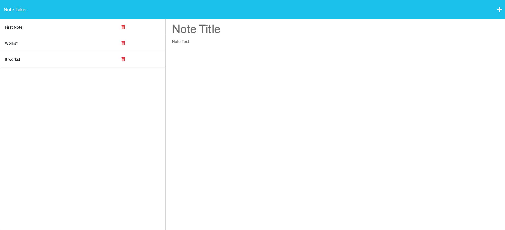

# ExpressJS Note Taker

## Description

- I built this project so that users can create new notes for themselves to set as reminders for later since the data/notes will persist
  in a database and be able to be check on later.

- What did you learn?
  I learned how to use expressjs as a backend to connect the front end and back end and allow users to create items that persist in the backend
  using a database folder/file.

## Installation

What are the steps required to install your project? Provide a step-by-step description of how to get the development environment running.

## Usage

Click "Get Started" button on the home page to be presented with your current notes on the left (if there are any yet), and a space in the middle
to add a new note title and note text. After adding the title and text, click the save icon in the top right and your note will be saved to your
list of notes on the left side. To view your note again, simply click on the title to bring up the note.

## License

MIT

## URL to Deployed Application

